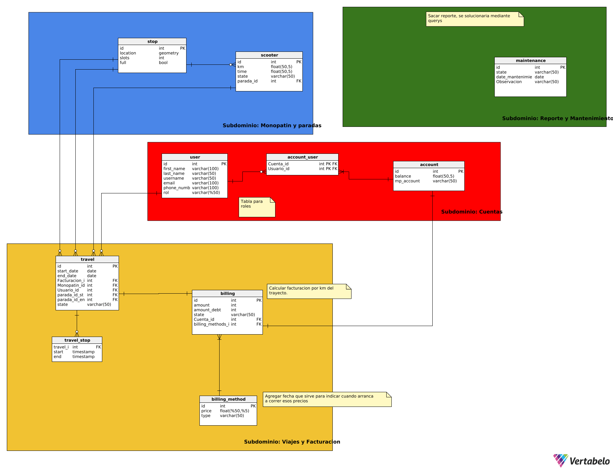

# TP Integrador 5 - Arquitecturas WEB

## Descripción del Proyecto

Este proyecto implementa una arquitectura de microservicios utilizando Spring Boot para crear varios servicios independientes que se comunican a través de Eureka, un servidor de descubrimiento de servicios. Cada microservicio se despliega de forma aislada en su propio contenedor Docker, lo cual permite una mayor escalabilidad y flexibilidad.

## Arquitectura y Tecnologías Utilizadas

- **Java JDK-21**: Lenguaje de programación para el desarrollo del backend de cada microservicio.
- **Spring Boot**: Framework principal para la creación de microservicios y servicios REST.
- **Eureka**: Servidor de descubrimiento de servicios que permite a los microservicios encontrarse y comunicarse entre ellos.
- **MySQL**: Base de datos utilizada para almacenar datos compartidos.
- **Docker**: Cada microservicio se ejecuta en su propio contenedor Docker, lo cual facilita la implementación y el despliegue.
- **Postman**: Herramienta utilizada para probar y verificar los servicios REST.

## Modelo Entidad-Relacion para microservicios


## Estructura de Microservicios

- **EurekaServiceApplication**: Servidor de descubrimiento que permite a los microservicios registrarse y descubrirse entre sí.
- **MicroservicioReportsApplication** (puerto 8082): Servicio de generación de reportes.
- **MicroservicioStopsApplication** (puerto 8081): Servicio que gestiona paradas o estaciones.
- **MicroservicioTravelsApplication** (puerto 8080): Servicio que maneja información de viajes.
- **MicroservicioUsersApplication** (puerto 8083): Servicio que gestiona información de usuarios.

Cada microservicio tiene su propia base de datos y configuración de Docker para ejecutarse de manera independiente.

## Instrucciones para Ejecutar el Proyecto Localmente

1. Clona este repositorio:
   ```bash
   git clone https://github.com/Coria97/TPE-Arquitecturas-Web.git

3. Ejecuta el script para levantar todos los contenedores Docker:
   Existen dos uno para windows otro para ubuntu:
   start_docker_windows.bat
   start_docker_ubuntu.sh

Este script ejecutará todos los archivos `docker-compose.yml` necesarios para levantar los microservicios y la base de datos, así como el servidor Eureka.

4. Una vez que los servicios estén en ejecución, verifica que todos los microservicios estén registrados en Eureka y comunicándose correctamente.

5. Si necesitas probar los endpoints de los microservicios, utiliza la colección de Postman disponible: [Microservicios-Postman](https://documenter.getpostman.com/view/24114875/2sAY55bduH)


## Información de los Estudiantes

- **Nombre y Apellido**: Santiago Coria
    
    - **Email**: santiagocoria@live.com.ar
    - **Sede**: Tandil
- **Nombre y Apellido**: Luciano Oroquieta Merlino
    
    - **Email**: oroquietaluciano@gmail.com
    - **Sede**: Tandil
- **Nombre y Apellido**: Matias Gatti Gonzalez
    
    - **Email**: matiasgatti2301@gmail.com
    - **Sede**: Tandil
- **Nombre y Apellido**: Micaela Ayelen Linares Diaz
    
    - **Email**: micaelaexactas1@gmail.com
    - **Sede**: Tandil

